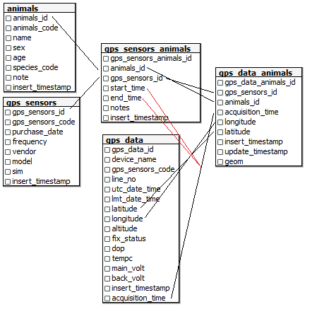

```{r setup, include=FALSE}
knitr::opts_chunk$set(echo = F)
library(data.table)
library(tidyverse)
library(rmarkdown)

```

# Relational database architechure

On the google drive, the raw data is roughly stored in this format:



To add data, you need to format the data to match the 4 leftmost tables and run the `addToDB.R` script.  When formatting, it is okay if you don't have information for all the columns, so long as the information you do have exactly matches the format the data is already in.

## 1.) the animals table

#### Necesary columns: `animals_code` and `data_source`

The animals table is formatted like this (used the arrows to see additional rows and columns):


```{r animals, layout="l-body-outset"}
head(fread("newDatabaseFiles/animals.csv"), 20) %>% paged_table(options = list(cols.print = 5))
```

Important additional info: `species_code` 1 means elk, `species_code` 2 means wolf (though think I removed them from this iteration of the database).  We can add more species if we wanted to add puma, guanaco etc.

## 2.) the sensors table

#### Necesary column: `gps_sensors_code` 

The sensors table is formatted like this (used the arrows to see additional rows and columns):


```{r sensors, layout="l-body-outset"}
head(fread("newDatabaseFiles/sensors.csv"), 20) %>% paged_table(options = list(cols.print = 5))
```


## 3.) the sensors-animals table

#### Necesary columns: `gps_sensors_animals_id`, `animals_code`, `gps_sensors_code`, `start_time` and `end_time`

The sensors-animals table is formatted like this (used the arrows to see additional rows and columns):


```{r sensAni, layout="l-body-outset"}
head(fread("newDatabaseFiles/sensorsAnimals.csv"), 20) %>% paged_table(options = list(cols.print = 5))
```

Important additional info: This is the key relational table. `gps_sensors_animals_id` is the main identifier combining both the animal and collar.  Potentially could automatically created this table from cleaned* animals, sensors and GPS tables.

*Up to now, this database is somewhat cleaned, meaning that when I built this at the end of 2019, I did a little bit of cleaning to ensure there were no duplicate animals, but didn't clean to the extent that there are no errant GPS points.

## 4.) the GPS table

#### Necesary columns: `gps_sensors_code`, `latitude`, `longitude`, and `acquisition_time`

The GPS table is formatted like this (used the arrows to see additional rows and columns):


```{r gps, layout="l-body-outset"}
head(fread("newDatabaseFiles/gpsSubset.csv"), 20) %>% paged_table(options = list(cols.print = 5))
```

Important additional info: this only includes successful fixes as of now.  It also contains a bunch of extra columns that aren't really necessary--we can discuss removing them.
